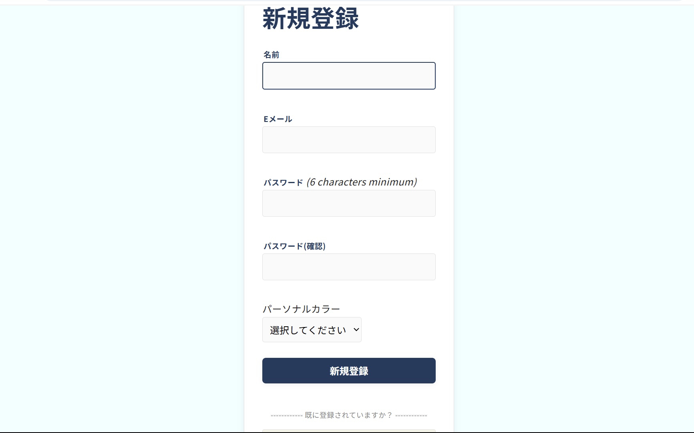
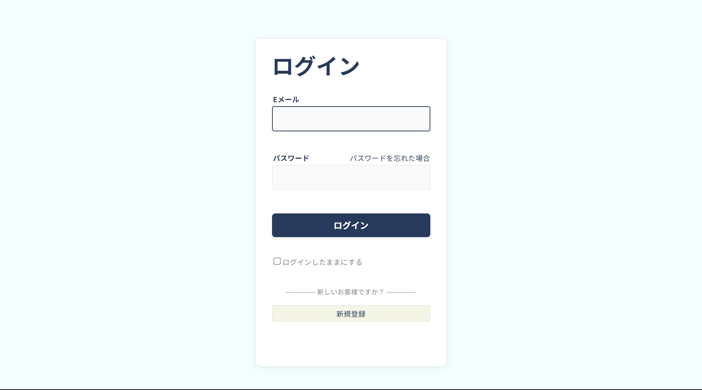
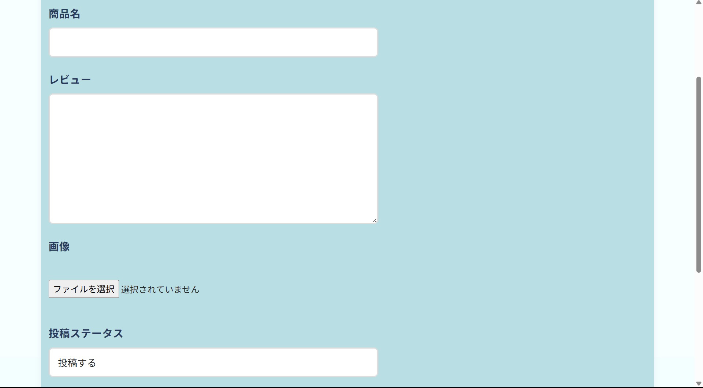
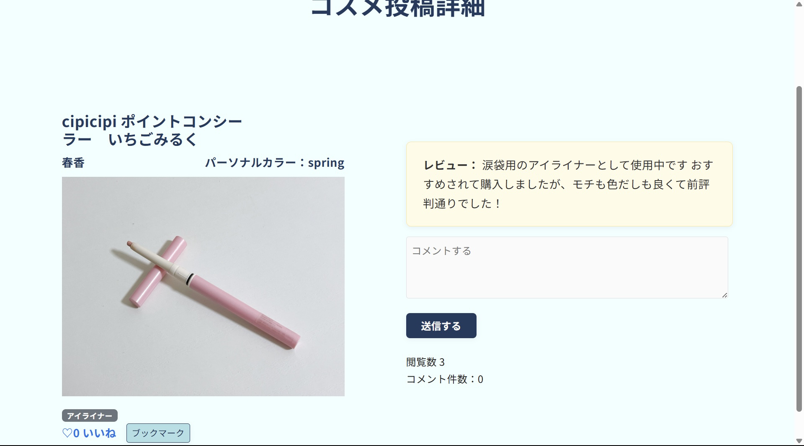
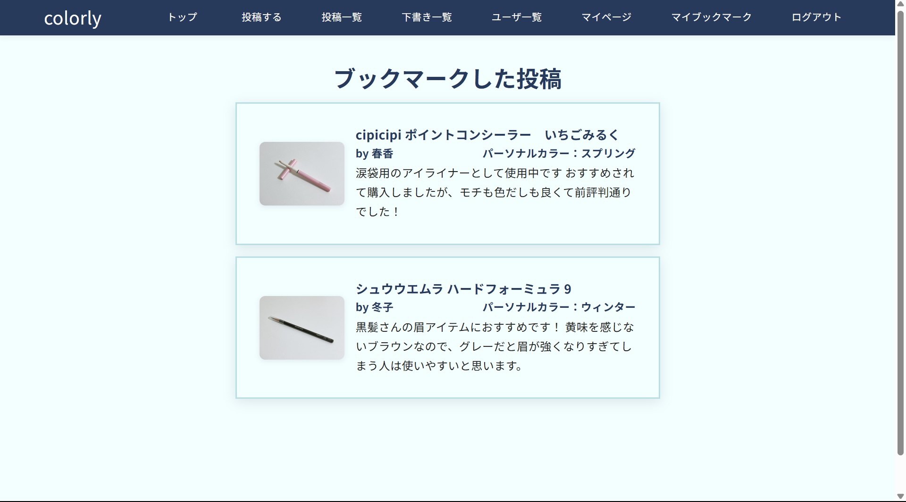
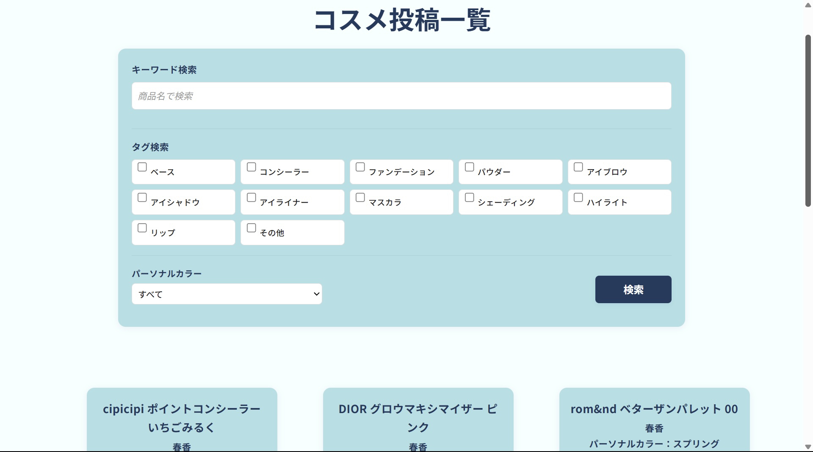
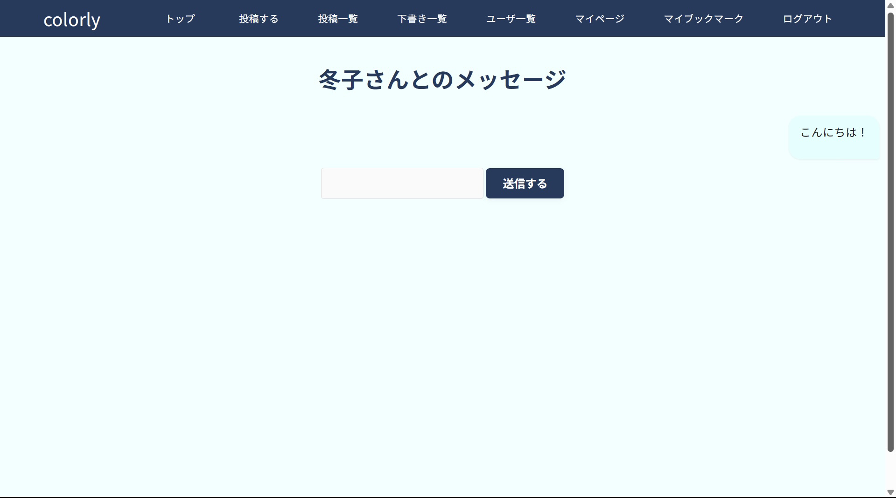

# Colorly
好きだけじゃない、似合うも欲しい。  

# 概要  
Colorlyは、パーソナルカラーに特化したコスメ情報の共有プラットフォームです。  
投稿は4タイプ（Spring / Summer / Autumn / Winter）に分類されており、自分に「似合う」コスメを探しやすくなっています。  
顔タイプ診断や骨格診断などのファッション要素はあえて取り入れず、「コスメだけ」に絞ったシンプルなイメコン・コミュニティを目指しました。  

# サイトテーマ  
より迷わず、シンプルに自分をアップデートするヒントを。  

# テーマを選んだ理由  
SNSでは情報があふれ、自分に本当に似合うコスメを見つけるのが難しいと感じることがあります。  
Colorlyではコスメに特化し、パーソナルカラー（4タイプ）で投稿を整理することで、より迷わず「自分に合う」情報に出会える場をつくりました。  

# きっかけ  
似合う色やコスメは人によって異なります。  
でも、SNSではコスメ以外の情報（服やアクセサリーなど）も混在していて、本当に欲しい情報にたどり着きにくいと感じました。  
だからこそ、「コスメだけ」に特化した情報が集まる場を作りたいと思いました。  

 
# 問題点  
・SNS上では、コスメ・服・アクセサリーなどが混ざり、情報が分かりづらい。  
・情報が多すぎて、自分と近い（参考になる）情報を探すのが大変。
・パーソナルカラー別の情報を、一括で見つけられる場所が少ない。

# 解決策  
「コスメのみ」に絞った投稿構成で、探したい情報にすぐアクセスできます。  
投稿ごとにパーソナルカラー（4タイプ）を紐づけて表示・検索できます。 

# ターゲットユーザー  
・「流行のコスメ」よりも、「自分に似合うコスメ」を知りたい人  
・SNSで情報を探しても、多すぎて自分に合うものが見つからない人  
・パーソナルカラー4タイプを参考にしてコスメを選びたい人  

# 主な利用シーン  
・新しいコスメを買う前に、自分のパーソナルカラーに合うか確かめたいとき  
　→ タイプやタグで検索すれば、同じ属性の人のリアルな投稿が見られます。  
・流行りのコスメが似合わなくてモヤモヤしたとき  
　→ 「似合う」に特化した情報が多く、自信を持って選べるヒントが見つかります。   
・アイシャドウやチークなどジャンルは決まっているけど、具体的な商品が決まらないとき  
　→ 同じタイプの人が選んださまざまなコスメのレビューを参考にできます。　

 # 利用方法  
・ユーザー新規登録を行う、またはログインする
　
　

・コスメを写真やレビューとともに投稿　
　

・他のユーザーの投稿を閲覧し、気に入った投稿に「いいね」や「コメント」を残す　
　

・他のユーザーの投稿をブックマークし、購入や利用の参考に見返せる　
　

・キーワードやカテゴリ検索を使い、目的に合わせた投稿をチェック　
　

・ユーザー間でメッセージのやり取り　
　

 
 # 機能一覧  
・基本的なCRUD機能　
・ユーザー認証機能(devise)　
・画像アップロード機能(Refile)
・ブックマーク機能　
・いいね機能　
・コメント機能　
・フォローフォロワー機能　
・DM機能　
・下書き機能　
・検索機能　
・閲覧数表示機能　
・バリデーション　
・ページネーション　
・レスポンシブ対応　

 
 # 開発環境
 ・OS：Windows11 + Git Bash　
 ・言語：HTML、CSS、Ruby　
 ・フレームワーク：Ruby on Rails　
 ・JSライブラリ：jQuery　
 ・データベース：PostgreSQL 　
